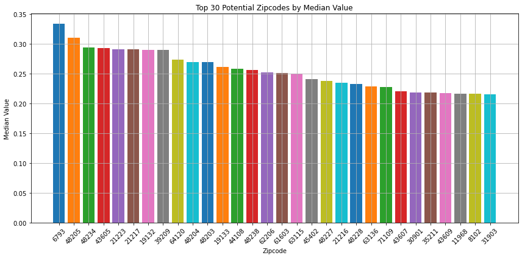

## US-house-price-analysis

* You can find the top 30 potential zipcodes for investment.

* Since I've already preprocessed the data, you can use the clean data under *./raw-data* folder by key word **filtered**' ( My bad that the processed data were put together with the raw data :) )

* Since It's a quick demo project, so I didn't put any effort on it. However, if you have any questions or suggestions, please feel free to contact me.

* Gmail: mianhuajidujing@gmail.com